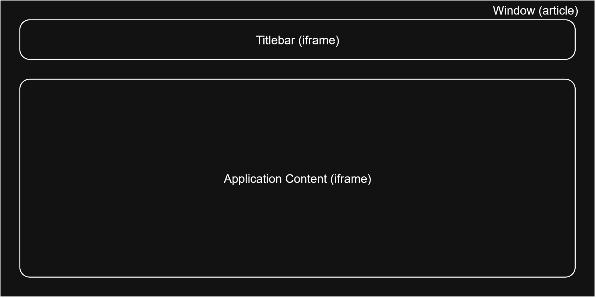

# **Webdesk**
Webdesk is a passion project of mine with the aim of making an OS type experience in a web app. Webdesk's objective is to provide maximum customization inside the browser, primarly for fun.
## **Desctiption**
Webdesk is a PWA that uses a Deno backend and HTML/JS for the frontend. The main gimmick of Webdesk are the **Applications**, which are static or dynamic web sites viewed inside the main page. These applications are opened from **Launchers** on the desktop. The applications are viewed from inside **Windows** that can be moved, resized and closed. The user can keep track of the open applications by checking the **App Dock** that contains the icons of the open applications, clicking on the icons will bring the corresponding application to the foreground and focus it. The windows use iframes for both the main content and the titlebar, allowing for custom functionalities tailored for the window application. The windows can also specify commands for the backend **API** for processing custom requests, allowing the windows to communicate with the backend using `fetch()` or directly using a `WebSocket`. Webdesk is built using event driven logic for maintainability and modularity in the frontend and static assets tables in the backend for speed, necessitating only a pathname lookup. A **Service Worker** is used to cache pages on the client side, relieving strain on the server and allowing offline use **(WIP)**. Webdesk supports custom color themes and backgrounds with light or dark icons.

(Event propagation tree diagram)

This diagram shows the method called for each event dispatch.

As stated above the main part of Webdesk are windows. These `<article>` elements use two iframes to make use straightforward for both the user and application developer.

## **To Do**
- [ ] Clean Up code
	- [ ] Improve async-ing
	- [ ] ~~Server side rendering of the page for lighthouse rules~~
	- [x] ~~Improve code readability~~
		- [x] ~~Variable names~~
		- [x] ~~Event wrapping methods (no anon functions)~~
- [ ] Finish Windows
	- [x] ~~Titlebar messaging system~~
	- [ ] ~~Titlebar message movement system~~
	- [ ] ~~Secure settings app priviledge~~
	- [ ] ~~Smooth movement with animation frames~~
	- [ ] Settable margin size for resizing
	- [x] ~~Add animations~~
- [ ] Improve styling rules
- [ ] Settings App
	- [x] ~~Add more sections~~
		- [x] ~~App dock~~
	- [x] ~~Finish settings~~
		- [x] ~~Add animations settings~~
		- [ ] ~~Add application settings~~
		- [x] ~~Finish customization page~~
		- [x] ~~Finish backgrounds page~~
- [ ] Terminal App
	- [ ] Add more commands
	- [ ] Improve the style
- [ ] Blog App
	- [ ] Begin it
- [ ] ~~Info App~~
- [x] ~~Finish service worker~~
	- [x] ~~Smart caching~~
	- [x] ~~Frontend element~~
- [ ] Event propagation tree diagram
- [ ] Do the mobile website of evil