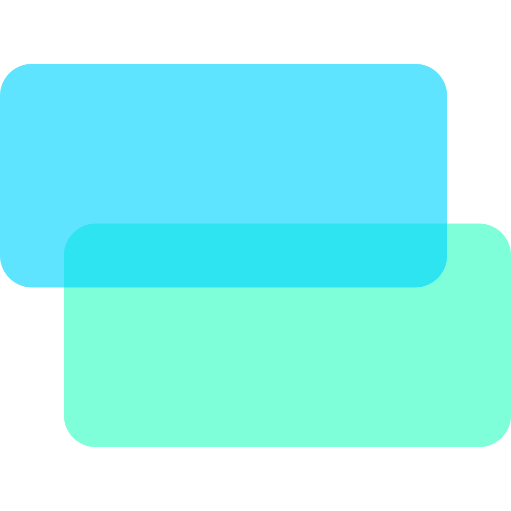

<p align="center">
	
	<p align="center"><a href="pizz.buzz">Website</a> ▪ <a href="#">Docs</a></p>
	<h1><strong>Webdesk</strong></h1>
</p>

> [!WARNING]
> Webdesk is a WIP! Expect shenanigans ahead!!

Webdesk is a passion project of mine with the aim of making an OS type experience in a browser, with the main objective of providing the maximum customization for the sake of beauty.

## Install
1. Make sure you have [Deno installed](https://deno.com/)
2. Clone the repository:
```bash
git clone https://github.com/FatiguedFrench/webdesk.git
```
3. Run the server:
```bash
deno task dev
```

## Applications
To create an application simply use `deno task app` and run through the wizard to create it

## Dependencies

- [Deno](https://deno.com/) - Backend server and application commands
- [Marked](https://marked.js.org/) - Blog markdown entry to html translator